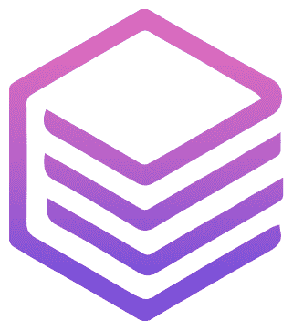

# EduAI: Enhanced Smart Academic Assistant



EduAI is an intelligent academic assistant that helps students manage their coursework, schedule, and study plans with enhanced AI-powered features. The application integrates with Canvas LMS data and provides a comprehensive suite of productivity tools for academic success.

## 🚀 Key Features

### **🤖 AI-Powered Chat Assistant**
- **Natural Language Processing**: Ask questions in plain English
- **Clarifying Questions**: AI asks follow-up questions for precise assistance
- **Modal Integration**: Chat controls seamlessly integrate with all app features
- **Confidence Indicators**: See how confident the AI is in its responses
- **Smart Command Recognition**: Understands complex academic queries

### **📋 Comprehensive Modal System**
- **Task Estimator**: AI-powered time estimation for assignments
- **Priority Settings**: Smart task prioritization with difficulty analysis
- **Study Peers**: Find and connect with study partners
- **Progress Tracker**: Visual progress monitoring with analytics
- **Deadlines Modal**: Advanced deadline management and rescheduling
- **Weekly Planner**: Intelligent weekly schedule optimization

### **🎨 Modern User Interface**
- **Responsive Design**: Works perfectly at all zoom levels (50%-100%)
- **Dual-Panel Layout**: Chat and tools work side-by-side
- **Beautiful Animations**: Smooth transitions with Framer Motion
- **Aurora Background**: Stunning visual effects
- **Professional Styling**: Modern cards, gradients, and typography

### **📊 Advanced Analytics**
- **Academic Insights**: Performance tracking and trend analysis
- **Smart Study Groups**: Active collaborative sessions
- **Task Completion Tracking**: Visual progress indicators
- **Time Management**: Detailed time allocation insights

### **🔗 Canvas Integration**
- **Real-time Data**: Connects with your Canvas LMS
- **Assignment Sync**: Automatic assignment and deadline tracking
- **Grade Integration**: Performance analysis based on actual grades

## 📁 Project Structure

```
EduAI/
├── backend/
│   ├── main.py                     # Enhanced Flask API server
│   ├── my_canvas_data.json         # Canvas data for AI assistant
│   ├── Scraper.py                  # Canvas data fetching tool
│   └── package.json                # Python dependencies
├── frontend/
│   └── EduAi/
│       ├── src/
│       │   ├── App.jsx                 # Main application with dual-panel layout
│       │   ├── Api/
│       │   │   └── ChatbotApi.jsx      # Enhanced chat interface
│       │   ├── components/
│       │   │   ├── TaskEstimator.jsx   # AI-powered time estimation
│       │   │   ├── PrioritySettings.jsx # Smart task prioritization
│       │   │   ├── StudyPeers.jsx      # Peer networking system
│       │   │   ├── ProgressTracker.jsx # Progress analytics
│       │   │   ├── DeadlinesModal.jsx  # Advanced deadline management
│       │   │   ├── WeeklyPlanner.jsx   # Weekly schedule optimization
│       │   │   ├── Dashboard/
│       │   │   │   └── RedesignedDashboard.jsx # Modern dashboard
│       │   │   ├── Layout/
│       │   │   │   ├── Cards/
│       │   │   │   │   ├── Leftcardlayout.jsx      # Task overview cards
│       │   │   │   │   ├── Rightcardlayout.jsx     # Analytics cards
│       │   │   │   │   ├── TaskOverviewCard.jsx    # Enhanced task display
│       │   │   │   │   ├── AcademicInsightsCard.jsx # Performance analytics
│       │   │   │   │   ├── StudyGroupCard.jsx      # Group management
│       │   │   │   │   └── PeerNetworkCard.jsx     # Peer connections
│       │   │   │   └── Navbar/
│       │   │   │       └── Navbar.jsx              # Compact navigation
│       │   │   ├── Calendar/
│       │   │   │   └── BigCalendarComponent.jsx    # Enhanced calendar
│       │   │   └── Animations/
│       │   │       ├── Aurora.jsx                  # Background effects
│       │   │       ├── AnimatedList.jsx            # List animations
│       │   │       └── SpotlightCard.jsx           # Card effects
│       │   ├── utils/
│       │   │   ├── ActionEngine.js                 # Command processing
│       │   │   └── CommandParser.js                # Natural language parsing
│       │   ├── index.css                           # Enhanced styling
│       │   └── main.jsx
│       ├── package.json
│       └── vite.config.js
└── README.md
```

## 🛠️ Setup Instructions

### Prerequisites

- **Node.js** (v16+)
- **Python** (v3.8+)
- **Git** for version control

### Backend Setup

1. **Navigate to backend directory:**
   ```bash
   cd backend
   ```

2. **Install Python dependencies:**
   ```bash
   npm install  # Installs Python packages via package.json
   # OR manually:
   pip install flask flask-cors faiss-cpu numpy sentence-transformers google-generativeai python-dateutil pytz
   ```

3. **Set up Google Generative AI API key:**
   ```bash
   # Create .env file
   echo "GEMINI_API_KEY=your-api-key-here" > .env
   ```

4. **Start the Flask server:**
   ```bash
   python main.py
   ```
   Server runs on: `http://localhost:5000`

### Frontend Setup

1. **Navigate to frontend directory:**
   ```bash
   cd frontend/EduAi
   ```

2. **Install dependencies:**
   ```bash
   npm install
   ```

3. **Start development server:**
   ```bash
   npm run dev
   ```
   Application runs on: `http://localhost:5173`

## 🎯 Usage Guide

### **Chat Interface**
- **Natural Language**: Type questions like "What's my schedule tomorrow?" or "Schedule a 3-hour math study session"
- **Modal Commands**: Say "Open task estimator" or "Show my deadlines"
- **Follow-up Questions**: The AI will ask clarifying questions when needed

### **Modal Features**

#### **Task Estimator** 
- Automatically detects tasks from your academic data
- AI-powered time estimation based on complexity
- Difficulty and focus level analysis

#### **Priority Settings**
- Smart task prioritization algorithm
- Urgency vs. importance matrix
- Customizable priority weights

#### **Study Peers**
- Find study partners based on courses
- Match percentage algorithm
- Online status and availability

#### **Progress Tracker**
- Visual progress charts and analytics
- Completion rate tracking
- Performance insights

#### **Deadlines Modal**
- Advanced deadline management
- Reschedule with AI assistance
- Priority-based sorting

#### **Weekly Planner**
- Intelligent schedule optimization
- Time block suggestions
- Conflict detection and resolution

### **Keyboard Shortcuts**
- `Ctrl + Enter`: Send chat message
- `Esc`: Close active modal
- `Tab`: Navigate between elements

## 🎨 Design Features

### **Responsive Layout**
- **100% Zoom**: Perfect for detailed work
- **50% Zoom**: Overview mode for multitasking
- **Mobile Ready**: Responsive design for all devices

### **Visual Elements**
- **Aurora Background**: Dynamic animated background
- **Gradient Cards**: Modern card designs with depth
- **Smooth Animations**: Framer Motion powered transitions
- **Professional Typography**: Carefully chosen font hierarchy

### **Color Scheme**
- **Primary**: Purple gradients (#ad46ff)
- **Secondary**: Blue accents
- **Background**: Dark theme with purple tones
- **Status Colors**: Green (success), Orange (warning), Red (urgent)

## 🔧 Development

### **Tech Stack**
- **Frontend**: React 18, Vite, Tailwind CSS, Framer Motion, Ant Design
- **Backend**: Flask, FAISS, Sentence Transformers, Google Generative AI
- **Tools**: ESLint, PostCSS, Autoprefixer

### **Key Packages**
```json
{
  "frontend": {
    "react": "^18.0.0",
    "framer-motion": "^10.0.0",
    "antd": "^5.0.0",
    "tailwindcss": "^3.0.0",
    "@material-tailwind/react": "^2.0.0"
  },
  "backend": {
    "flask": "^2.0.0",
    "faiss-cpu": "^1.7.0",
    "sentence-transformers": "^2.0.0",
    "google-generativeai": "^0.3.0"
  }
}
```

### **Architecture**
- **Dual-Panel System**: Chat and modals work seamlessly together
- **LLM Integration**: Natural language processing throughout
- **State Management**: Centralized state for all modals
- **Command Engine**: Sophisticated command parsing and execution

## 📊 Canvas Integration

### **Using Sample Data**
The application includes comprehensive sample data for immediate testing.

### **Connect Your Canvas**
1. **Get Canvas API Token:**
   - Go to Canvas → Account → Settings → New Access Token

2. **Update Scraper:**
   ```python
   # In backend/Scraper.py
   API_KEY = "your-canvas-api-token"
   BASE_URL = "https://your-institution.instructure.com"
   ```

3. **Fetch Your Data:**
   ```bash
   cd backend
   python Scraper.py
   ```

## 🚀 Deployment

### **Frontend (Netlify/Vercel)**
```bash
cd frontend/EduAi
npm run build
# Deploy dist/ folder
```

### **Backend (Heroku/Railway)**
```bash
cd backend
# Add Procfile: web: python main.py
git push heroku main
```

## 🤝 Contributing

1. **Fork the repository**
2. **Create feature branch:** `git checkout -b feature/amazing-feature`
3. **Commit changes:** `git commit -m 'Add amazing feature'`
4. **Push to branch:** `git push origin feature/amazing-feature`
5. **Open Pull Request**

## 📄 License

This project is licensed under the MIT License - see the [LICENSE](LICENSE) file for details.

## 📞 Support

- **GitHub Issues**: [Report bugs or request features](https://github.com/mantavya0807/eduAI/issues)
- **Email**: support@eduai.com
- **Documentation**: [Full documentation](https://docs.eduai.com)

## 🏆 Acknowledgments

- **Google Generative AI** for powerful language processing
- **Canvas LMS** for educational data integration
- **React Community** for excellent development tools
- **Contributors** who made this project possible

---

**Built with ❤️ for students, by students** 🎓

